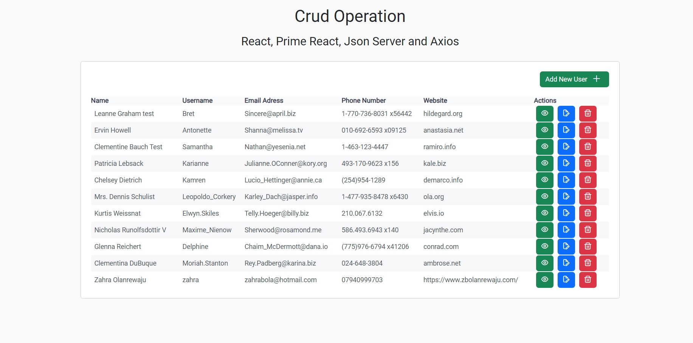

# Crud React App

This project is a  CRUD operations in ReactJS, using axios and JSON Server 

### `npm run build`
 Clone this repository to your local machine: https://github.com/zahrabola/my-crud-zahra
 Open a terminal window
Install node package manager and json-server globally on your system. You can do this by running the following commands in your terminal:
npm install and npm install -g json-server

guide : https://www.dhiwise.com/post/how-to-use-json-server-in-frontend-development 
Inside Terminal - Command Prompt start the JSON Server to simulate a RESTful API by running the following command:
json-server --watch db.json --port 4000

This command will start the JSON Server using the db.json file as the data source and expose it at http://localhost:4000/users#

Open another terminal window keeping the first one running,then Start the React application by running the following command:
npm start \

The application will be accessible at http://localhost:3000
The page will reload when you make changes, you may also see any lint errors in the console.

Netlify deployed website -  https://serene-donut-794897.netlify.app/